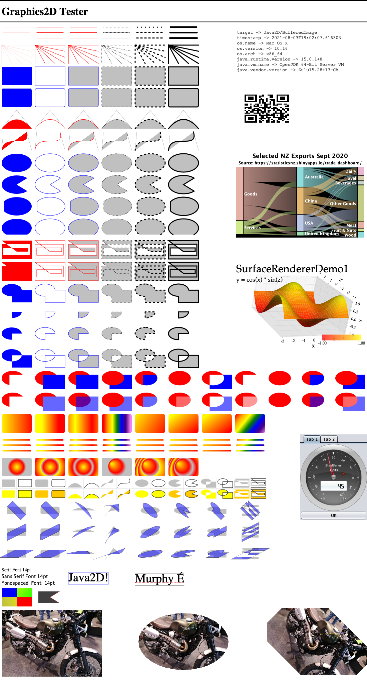

# Graphics 2D Tester

Overview
--------
A visual tester for implementations of Java2D's `Graphics2D` class.  The program generates a pre-defined set of outputs 
for any provided subclass of `Graphics2D` that can be compared against a known good result.  The following 
libraries (as well as others) can be tested this way:

- [JFreeSVG](https://github.com/jfree/jfreesvg)
- [JFreePDF](https://github.com/jfree/jfreepdf)
- [FXGraphics2D](https://github.com/jfree/fxgraphics2d)
- [SkijaGraphics2D](https://github.com/jfree/skijagraphics2d)

By running through the features of `Graphics2D` systematically, this test kit is
able to highlight areas of weakness in a particular implementation.  The goal is to drive improvements in the
available implementations.

Target Output
-------------
The output of the `Graphics2D` target under test must be manually compared against the expected ("correct") output.  The expected output can be generated by running the test program against the `Graphics2D` instance used by Java2D itself 
when drawing to a `BufferedImage`.  For example, the following output is generated with Java 15 on MacOS:

Third Party Libraries
---------------------
The test kit uses several third party libraries:

- [ZXing](https://github.com/zxing/zxing) - used to create a QR code which is (a) part of the test and (b) provides a link to the `Graphics2D` implementation under test;

- [JFreeChart](https://github.com/jfree/jfreechart) - used to create a sample 2D chart;

- [Orson Charts](https://github.com/jfree/orson-charts) - used to create a sample 3D chart;

- [SteelSeries-Swing](https://github.com/HanSolo/SteelSeries-Swing) - used within the Java Swing UI demo to draw a dial