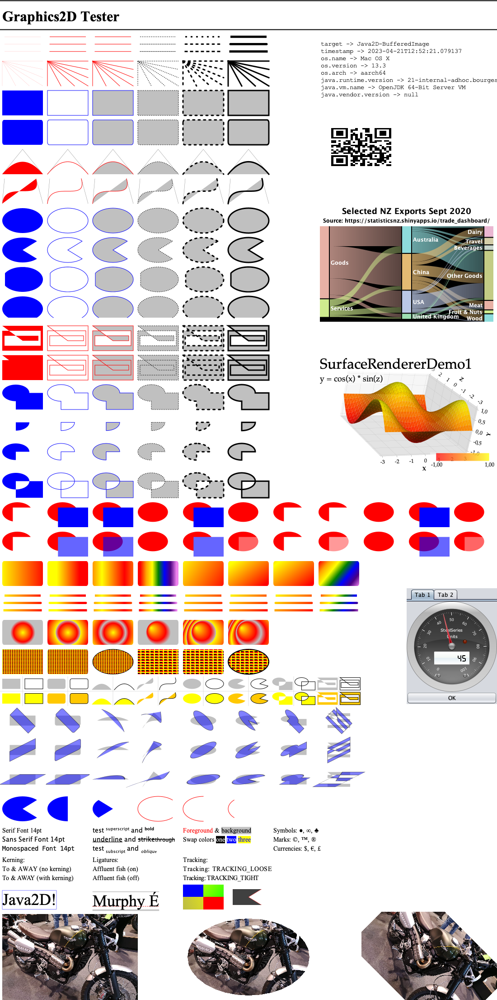

# Graphics 2D Tester

Overview
--------
A visual tester for implementations of Java2D's `Graphics2D` class.  The goal is
to perform a sanity check on the output from a particular subclass of `Graphics2D`. 
This includes, but is not limited to, the following libraries:

- [JFreeSVG](https://github.com/jfree/jfreesvg)
- [JFreePDF](https://github.com/jfree/jfreepdf)
- [FXGraphics2D](https://github.com/jfree/fxgraphics2d)
- [SkijaGraphics2D](https://github.com/jfree/skijagraphics2d)

By running through the features of `Graphics2D` systematically, this test kit is
able to highlight areas of weakness in a particular implementation.

Target Output
-------------
The expected output can be generated by running the test program against the
`Graphics2D` instance used by Java2D itself when drawing to a `BufferedImage`.  Here 
is an example (generated with Java 15 on MacOS):

Third Party Libraries
---------------------
The test kit uses several third party libraries:

- [ZXing](https://github.com/zxing/zxing) - used to create a QR code which is (a) part of the test and (b) provides a link to the `Graphics2D` implementation under test;

- [JFreeChart](https://github.com/jfree/jfreechart) - used to create a sample 2D chart;

- [Orson Charts](https://github.com/jfree/orson-charts) - used to create a sample 3D chart;

- [SteelSeries-Swing](https://github.com/HanSolo/SteelSeries-Swing) - used within the Java Swing UI demo to draw a dial